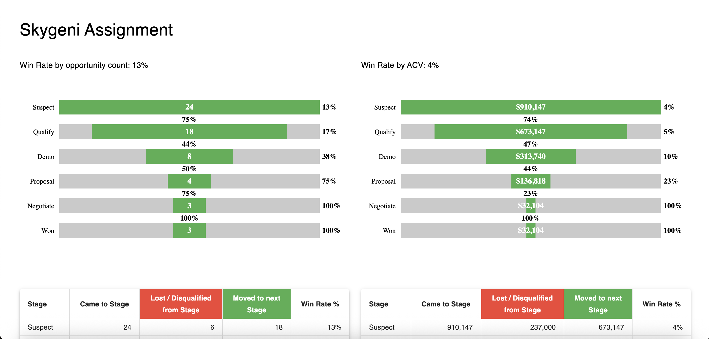
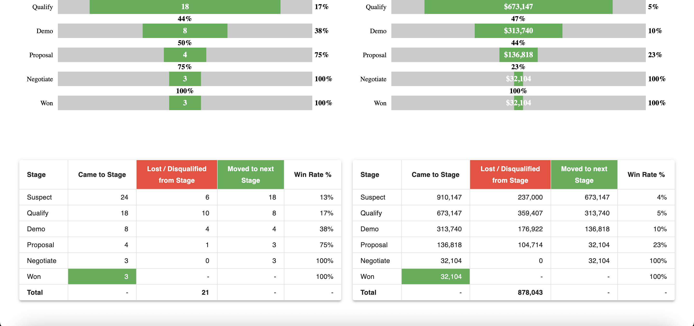
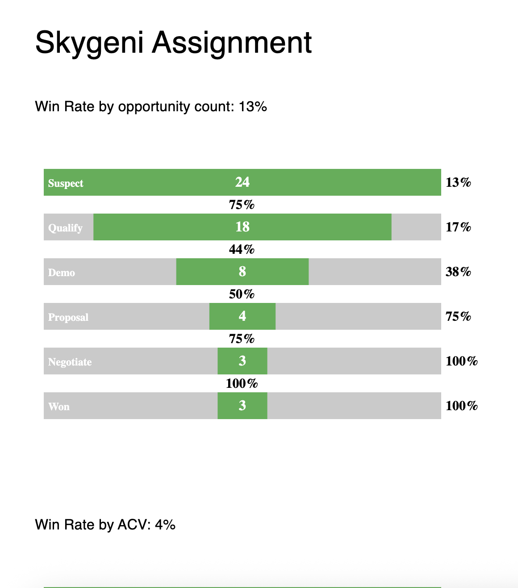
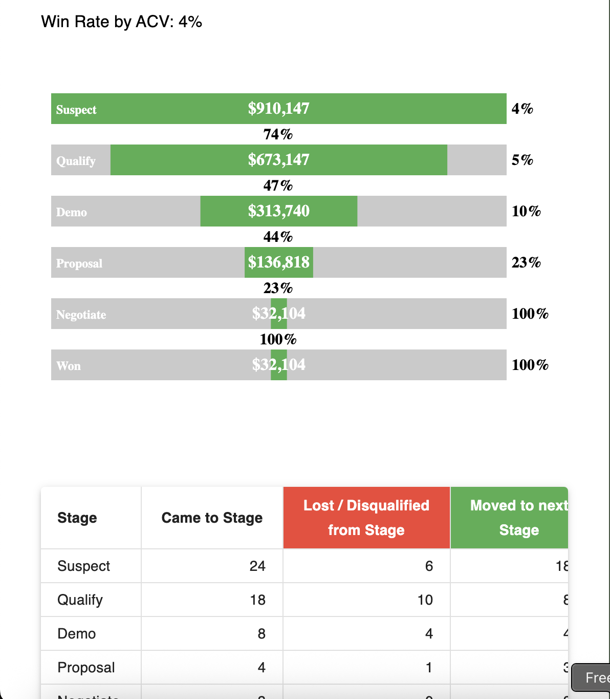
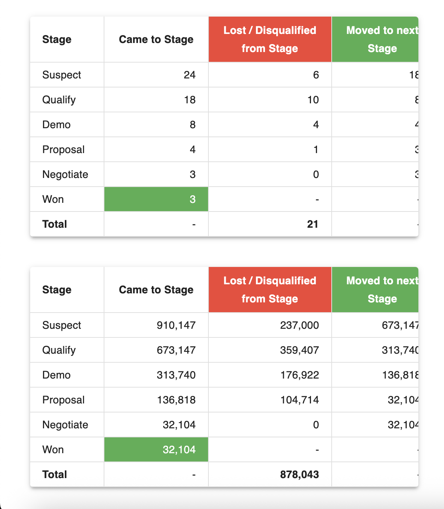
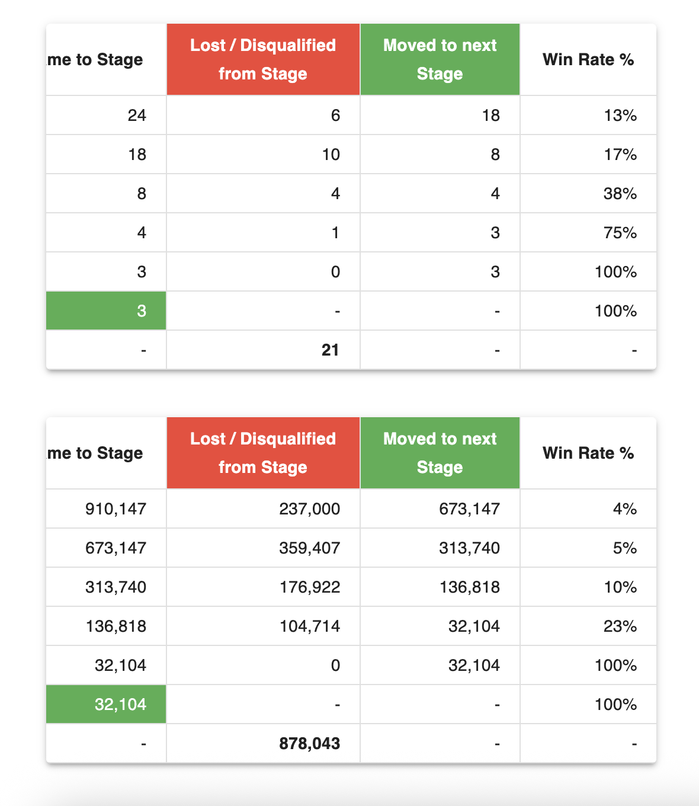

# Sales Pipeline Analysis Dashboard ( Assignment )

A data visualization dashboard analyzing sales pipeline metrics including win rates by opportunity count and ACV (Annual Contract Value).

## 📸 Screenshots

### Desktop View
|  |  |
|-------------------------------------------------------------------------------------|-------------------------------------------------------------------------|
| *Win Rate by Opportunity Count and ACV*                                                     | *Count and ACV Transition Table*                                   |

### Mobile View
|  |  |
|--------------------------------------------------------------------------|------------------------------------------------------------------------|
| *Win Rate by Opportunity Count*                                                   | *Win Rate by ACV*                                                        |

|  |  |
|----------------------------------------------------------------------------------|---------------------------------------------------------------------------|
| *Count and ACV Transition Table*                                                | *Scrollable Transition Table*                                                |
