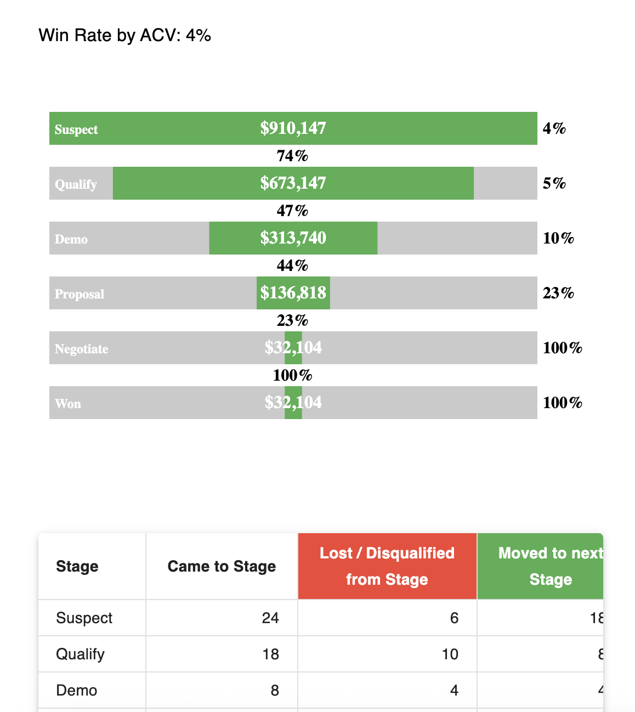

# Sales Pipeline Analysis Dashboard ( Assignment )

A data visualization dashboard analyzing sales pipeline metrics including win rates by opportunity count and ACV (Annual Contract Value).

## 📸 Screenshots

### Desktop View
|  |  |
|-------------------------------------------------------------------------------------|-------------------------------------------------------------------------|
| *Win Rate by Opportunity Count*                                                     | *Detailed Stage Transitions with ACV*                                   |

### Mobile View
|  |  |
|--------------------------------------------------------------------------|------------------------------------------------------------------------|
| *Mobile Summary View*                                                   | *ACV by Stage*                                                        |

|  |  |
|----------------------------------------------------------------------------------|---------------------------------------------------------------------------|
| *Opportunity Flow Between Stages*                                                | *ACV Flow Between Stages*                                                |
